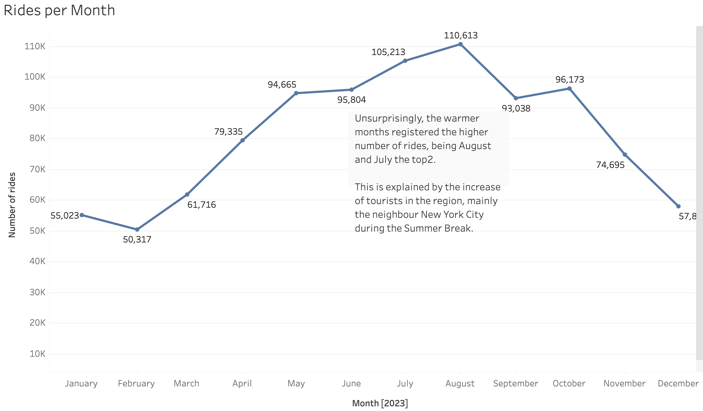
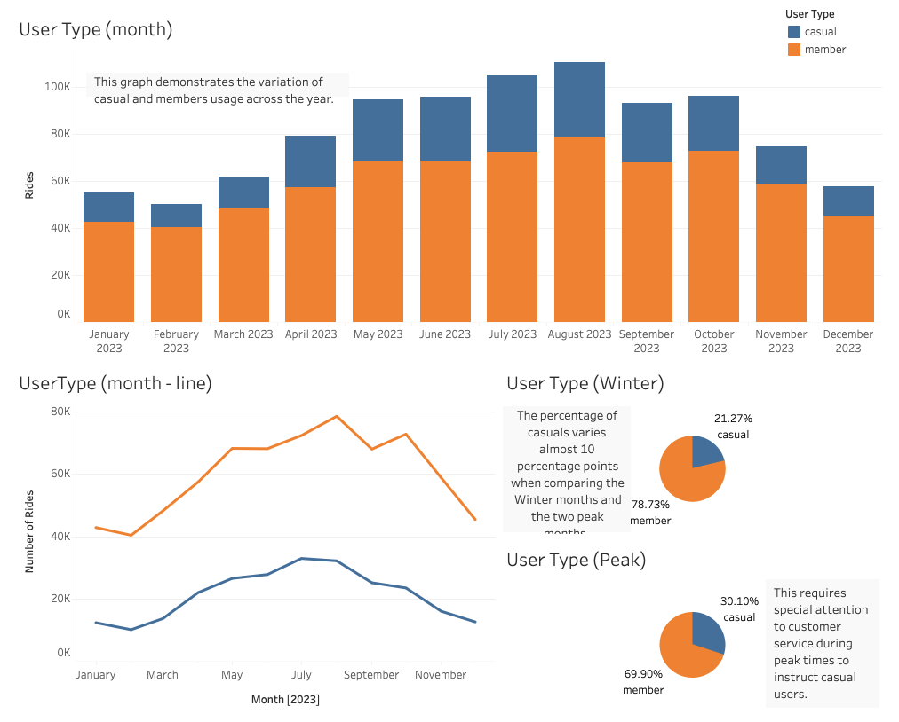
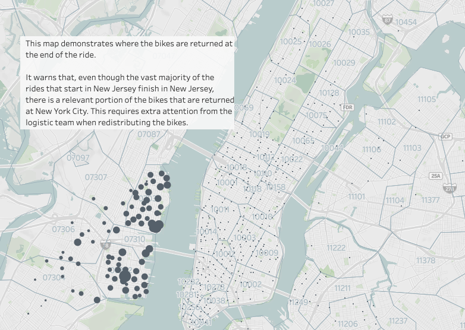
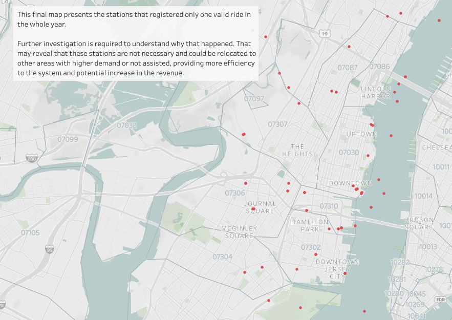

## Tableau: CitiBike Analysis

 

### 1. Overview

This project focuses on analysing data from the Citi Bike Program, the largest bikeshare program in the United States, to uncover unexpected phenomena.

The complete analysis, published in Tableau Public, is available for consultation at https://public.tableau.com/app/profile/fabiano.santos7780/viz/Challenge18-TableauCitiBike/CitiBikePresentation?publish=yes.

### 2. Resources

To complete this project, the following tools were used:

- Tableau
- Python (Pandas)

### 3. Development Process

The project was structured in two main phases:

#### 3.1 Data Cleansing and Preparation

Monthly data from the year 2023 usage of the CitiBike program in Jersey City, NJ, was obtained in separate CSV files. The data underwent cleaning using Pandas to eliminate incomplete records. Subsequently, the cleaned data was consolidated into a single CSV file containing approximately 975k records.

#### 3.2 Data Analysis and Visualisation

The cleaned dataset was imported into Tableau for an in-depth analysis, incorporating various charts, maps, and dashboards with accompanying insightful comments for each analysis.

Key insights derived from the analyses:

- August emerged as the busiest month, with ride numbers exceeding twice the count of the least active month, February. Understanding peak and off-peak periods is vital for effective planning of operations such as staffing, maintenance, and marketing campaigns.

 

- During peak seasons, notably summer, there was a substantial increase of almost 9 percentage points in the proportion of casual users. This finding suggests the need for a specialised program to support and inform casual members during these periods.

 

- A significant volume of trips originating in Jersey City concluded at bike stations in neighboring New York City, primarily on Manhattan Island. This trend underscores the importance of optimising logistics to prevent station shortages in Jersey City.

 

- Several stations recorded only a single ride throughout the entire year. To enhance operational efficiency and improve customer experience, it is recommended that these underutilised stations be either deactivated or relocated to busier areas.

 

### 4. Data Source and Other Resources

The data used in this project was exported from:

- CitiBike System Data. (2024). Dowloadable files of Citi Bike trip data. Retrieved 1 May 2024, from https://citibikenyc.com/system-data.

The picture used in this project was retrieved from:

- BKReader. (2024). Citi Bike Prices Hikes Start Today. Retrieved 25 August 2024, from https://www.bkreader.com/business-innovation/citi-bike-price-hikes-start-today-8054145.
